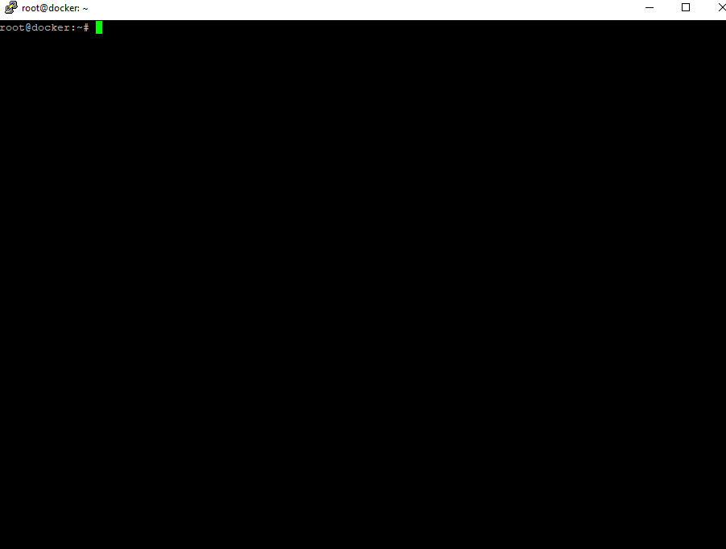

> TODO: add proper readme

[](#)

```
# install htpasswd
apt install apache2-utils

# generate a self-signed key
openssl req -x509 -nodes -days 365 -newkey rsa:2048 -keyout ssl.key -out ssl.crt

# generate a htpasswd file
htpasswd -c htpasswd USERNAME

# copy the authorized_keys file
cp ~/.ssh/authorized_keys .

# deploy
docker stack deploy --compose-file docker-compose.yml dock

# verify
docker service ls
```
